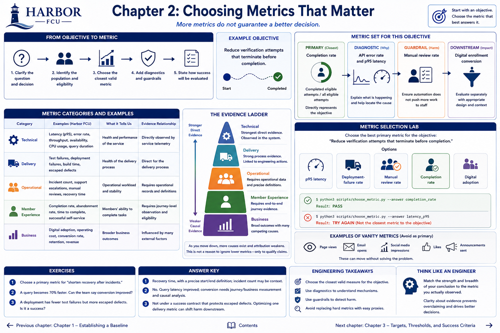

# Chapter 2: Choosing Metrics That Matter



> **Status:** Implemented. The institution and examples are fictional.

## Learning objectives

Distinguish technical, delivery, operational, member-experience, and business metrics; select a metric that matches an objective; and explain why causal evidence usually weakens farther down the outcome chain.

## Banking context

The verification team can measure hundreds of things. More metrics do not guarantee a better decision. If the objective is “reduce attempts that terminate before completion,” completion rate is closer than CPU usage or digital adoption.

## Engineering concept

Start with a question and decision, then choose a metric whose numerator, denominator, unit, population, and window answer it. Use diagnostic metrics to explain a primary outcome, and guardrails to detect harm. Avoid vanity metrics that move without resolving the stated problem.

## Measurable-outcome concept

| Category | Harbor examples | Typical evidence relationship |
|---|---|---|
| Technical | latency, error rate, throughput, availability, query duration | Directly observed by service telemetry |
| Delivery | test failures, deployment failures, escaped defects | Direct for the delivery process |
| Operational | incident count, support escalations, manual reviews, recovery time | Requires operational records and definitions |
| Member experience | completion, abandonment, time to complete, successful self-service | Requires journey-level observation and eligibility |
| Business | digital adoption, operating cost, conversion, retention | Broad outcome with many competing causes |

Engineers commonly have the strongest direct evidence for technical behavior. Delivery and operational outcomes require linked process data. Member measures require end-to-end journey evidence, not only API telemetry. Business metrics are influenced by pricing, campaigns, seasonality, eligibility, and many other changes. This is not a reason to ignore broader metrics; it is a reason to qualify causal claims.

For the objective “reduce terminated verification attempts”:

* **Primary:** completion rate, completed eligible attempts / all eligible attempts.
* **Diagnostic:** API error rate and p95 latency.
* **Guardrail:** manual-review rate, so automation does not merely push more work to staff.
* **Downstream:** digital enrollment conversion, evaluated separately with an appropriate design.

## Planned Harbor FCU scenario

Learners select from p95 latency, deployment-failure rate, manual reviews, completion rate, and digital adoption. All could matter, but only one directly represents the stated objective.

## Metrics to measure

The laboratory focuses on selection rather than creating a new dataset. `completion_rate` is a member-experience metric. A service success rate is a useful proxy only if one service call reliably represents one eligible attempt; that assumption should be tested with journey instrumentation.

## Implementation

A minimal command-line checker gives deterministic feedback and a nonzero exit for a mismatched choice, making the reasoning machine-checkable without pretending metric selection is universally automatic.

## Planned executable exercise

```bash
python3 scripts/choose_metric.py --answer completion_rate
```

It returns `PASS`. To see why proximity matters, run `python3 scripts/choose_metric.py --answer latency_p95`; it returns `TRY AGAIN` and exit status 1. That metric diagnoses speed but does not directly count completed attempts.

## What to observe and interpret

A metric may be valuable yet wrong as the primary outcome. Latency could fall while completion does not change. Conversely, completion could rise because of unrelated eligibility changes. Pair the primary measure with diagnostics, guardrails, and contextual segmentation.

## Engineering tradeoffs and evidence limitations

Closer metrics are easier to attribute but narrower in meaning. Broader metrics matter to the organization but weaken a single team's causal claim. Avoid replacing a hard-to-measure objective with an easy proxy without stating the gap.

## Automated tests

`python3 -m unittest tests.test_cli_labs.CliLabsTest.test_metric_choice -v` verifies both accepted and rejected answers.

## Exercises

1. Choose a primary metric for “shorten recovery after incidents.”
2. A query becomes 70% faster. Can the team say conversion improved?
3. A deployment has fewer test failures but more escaped defects. Is it a success?

### Answer key

1. Recovery time, with a precise start/end definition; incident count may be context.
2. No. Query latency improved; conversion needs journey/business measurement and causal analysis.
3. Not under a success contract that protects escaped defects. Optimizing one delivery metric can shift harm downstream.

## Expected takeaway

Choose the closest valid measure for the objective, then use secondary metrics to diagnose mechanisms and guard against harm.

## Chapter summary

Metric categories form an evidence ladder, not a prestige ladder. The strength and breadth of the conclusion must match what was actually observed.


[Previous chapter](chapter-01-establishing-a-baseline.md) | [Contents](../../CONTENTS.md) | [Next chapter](chapter-03-targets-thresholds-and-success-criteria.md)
