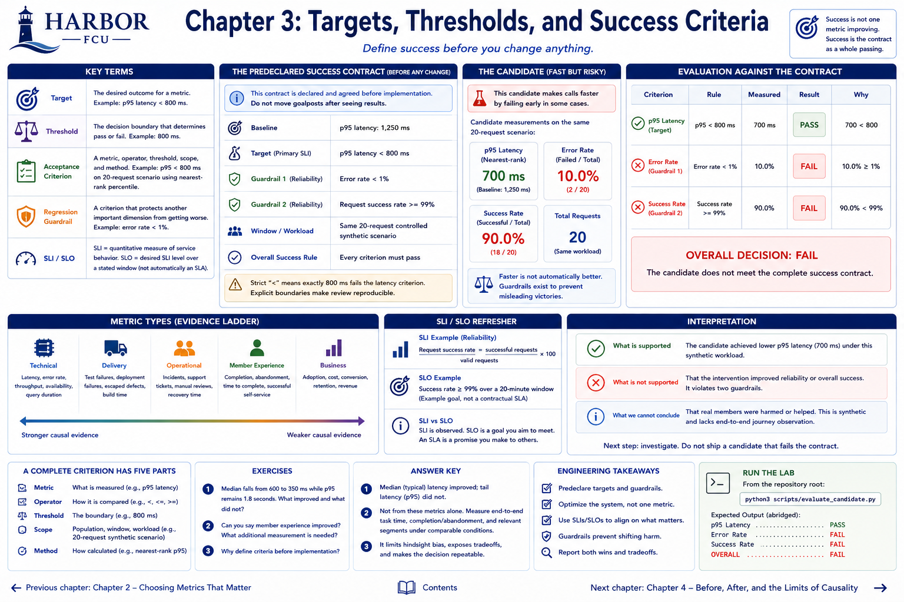

# Chapter 3: Targets, Thresholds, and Success Criteria



> **Status:** Implemented with a deliberately unsuccessful synthetic candidate.

## Learning objectives

Define success before intervention; distinguish target, threshold, acceptance criterion, and regression guardrail; apply an SLI/SLO; and evaluate a candidate as a complete contract.

## Banking context

Harbor FCU's fictional baseline verification p95 is 1,250 ms. The team can make calls faster by failing early. Speed alone would look better while task reliability gets worse. Predeclared guardrails prevent that misleading victory.

## Engineering concept

A **target** is the desired result. A **threshold** is a decision boundary. An **acceptance criterion** combines a metric, comparison operator, threshold, scope, and measurement method. A **regression guardrail** is a criterion protecting another important dimension.

A **service-level indicator (SLI)** is a quantitative view of service behavior, such as successful requests / valid requests. A **service-level objective (SLO)** is a desired SLI level over a stated window. An SLO is not automatically a contractual SLA.

## Measurable-outcome concept

Declare this contract before changing code:

```text
Baseline p95 latency: 1,250 ms
Target: p95 latency < 800 ms
Guardrails: error rate < 1%; request success rate >= 99%
Window/workload: same 20-request controlled synthetic scenario
Overall success: every criterion passes
```

Strict `<` differs from `<=`; exactly 800 ms fails the latency criterion. Explicit boundaries make review reproducible and discourage moving goalposts after results appear.

## Planned Harbor FCU scenario

The fast candidate lowers p95 to 700 ms but fails two of 20 requests: 10% error and 90% success. It demonstrates a local optimization that is not overall success.

## Metrics to measure

Latency p95 is the target SLI. Error and success rates are guardrail SLIs. In production, success and error are complements here, so both are pedagogically redundant; they are retained to teach the requested contract. A real design might instead add dependency load or manual-review rate as a nonredundant guardrail.

## Implementation

`Criterion` stores a metric attribute, operator, and numeric threshold. `evaluate_measurement` returns individual results, preserving why an overall decision passed or failed. It does not bury the contract in a script.

## Planned executable exercise

```bash
python3 scripts/evaluate_candidate.py
```

Observe p95 `PASS`, error rate `FAIL`, success rate `FAIL`, and overall `FAIL`. The script exits normally because an experimentally rejected candidate is a valid lab result, not a broken command.

## What to observe and interpret

Supported: the candidate was faster and did not meet the complete predeclared criteria under the measured workload. Unsupported: it harmed real members, because this is synthetic and lacks journey observation. The appropriate engineering decision is to keep investigating rather than relabel partial success as success.

## Engineering tradeoffs and evidence limitations

Tight thresholds can be costly or unstable with small samples. Loose thresholds can accept meaningful regressions. Set targets from user/operational needs, baseline evidence, and feasible tradeoffs—not because a round number sounds impressive. A 20-request window can demonstrate evaluation logic but cannot validate a real SLO.

## Automated tests

`python3 -m unittest tests.test_part1_scenarios.Part1ScenarioTest.test_fast_candidate_fails_complete_contract -v` asserts that one improvement cannot mask guardrail failures.

## Exercises

1. Median falls from 600 to 350 ms while p95 remains 1.8 seconds. What improved and what did not?
2. Can you say member experience improved? What additional measurement is needed?
3. Why define criteria before implementation?

### Answer key

1. Typical/median latency improved; tail p95 did not.
2. Not from these metrics alone. Measure end-to-end task time, completion/abandonment, and relevant segments under comparable conditions.
3. It limits hindsight bias, exposes tradeoffs, and makes the decision repeatable.

## Expected takeaway

Improving one metric while violating a guardrail is not success under a complete success contract.

## Chapter summary

Predeclared targets turn measurements into decisions. Guardrails ensure the intervention improves the system rather than shifting damage to another dimension.


[Previous chapter](chapter-02-choosing-metrics-that-matter.md) | [Contents](../../CONTENTS.md) | [Next chapter](chapter-04-before-after-and-the-limits-of-causality.md)
