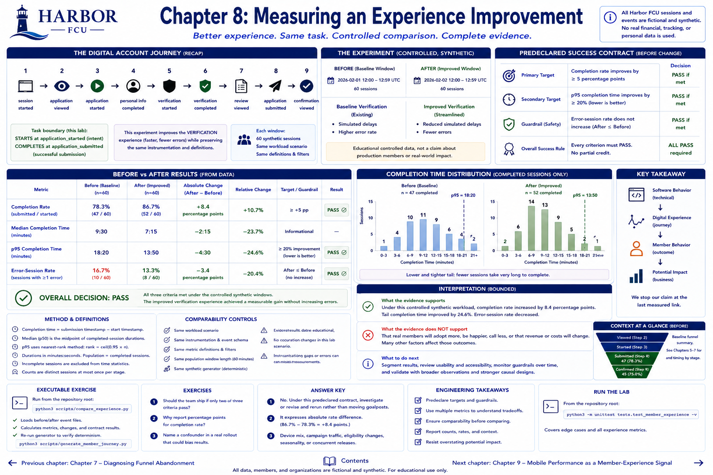

# Chapter 8: Measuring an Experience Improvement

> **Status:** Implemented. All Harbor Federal Credit Union (Harbor FCU) sessions and events in this chapter are fictional and synthetic.

## Learning objectives

A controlled before/after comparison evaluates a streamlined synthetic verification step against predeclared targets and a guardrail. Learners will calculate the chapter metrics, interpret tradeoffs, and state evidence limitations without inventing causality.

## Banking context

A prospective member may arrive at a working application and still fail to accomplish the intended digital task. Harbor FCU therefore observes the journey, not merely whether its software returned a page.

## Engineering concept

The before and after windows each contain 60 deterministic sessions with the same identifier convention and instrumentation. The intervention reduces simulated verification delay and errors. This is educational controlled data, not a claim about production members. We measure completion, median and p95 completion time, and error-session rate.

## Measurable-outcome concept

Primary target: completion rate improves by at least 5 **percentage points**. Secondary target: p95 completion time improves by at least 20%. Guardrail: error-session rate must not increase. Overall success requires every declared criterion; a partial improvement is not silently relabeled success. Comparability improves attribution, but a before/after still has fewer causal protections than random assignment.

## Planned Harbor FCU scenario

The shared event schema is `session_id`, `event_type`, UTC `timestamp`, `step`, `result`, and elapsed `duration_ms`. Identifiers such as `session_0001` are not people. The generator is deterministic, and the provenance explicitly excludes real financial, tracking, or personal data.

## Metrics to measure

The lab reports numerator and denominator, percentages, counts, units, population, and relevant exclusions. It reuses nearest-rank `percentile` and Part I `Criterion` evaluation from `src/harbor_fcu/measurement.py` through `src/harbor_fcu/member_experience.py`.

## Implementation

Reusable calculations live in the package; the command is a thin report. Event collections are materialized where repeated passes are required. Empty or undefined populations raise `ValueError` rather than returning a persuasive-looking zero.

## Planned executable exercise

Run `python3 scripts/compare_experience.py`. Values are calculated from both CSVs. Explain why completion passes, the timing target may pass or fail, and the guardrail result. Re-run `python3 scripts/generate_member_journey.py` and compare file hashes to verify determinism.

## What to observe and interpret

Follow the progression `software behavior → digital experience → member behavior → measured outcome → potential organizational impact`. Stop the claim at the last measured link. Page traffic, member happiness, assistance, revenue, and cost are separate measures unless explicitly observed.

## Engineering tradeoffs and evidence limitations

More instrumentation can improve diagnosis but adds event-quality, privacy, accessibility, and maintenance concerns. This small teaching model avoids a production analytics platform. Counts depend on event delivery and definitions; synthetic controlled results may not generalize to real populations. Preserve raw observations and investigate missing, duplicated, or out-of-order events.

## Automated tests

Run `python3 -m unittest tests.test_member_experience -v`. Edge cases cover no starts, empty durations, zero-stage reach, nearest-rank tails, stage timing, comparisons, and success criteria. Run the full suite before drawing conclusions.

## Exercises

1. Should the team ship if only two of three criteria pass?
2. Why report percentage points for rates?
3. Name a confounder in a real rollout.

**Answer key:** (1) Not under the predeclared all-criteria decision; investigate or revise and rerun rather than moving the goalposts. (2) It expresses the absolute rate difference. (3) Device mix, campaign traffic, eligibility, seasonality, or concurrent releases.

## Expected takeaway

A technically correct application is an output. A defensible member-experience outcome requires a defined task, reproducible observations, multiple metrics, criteria, and claim restraint.

## Chapter summary

Chapter 8 connects observable member-journey behavior to measured outcomes while keeping possible organizational effects explicitly downstream and unproven.

[Previous chapter](chapter-07-diagnosing-funnel-abandonment.md) | [Contents](../../CONTENTS.md) | [Next chapter](chapter-09-mobile-performance-as-a-member-experience-signal.md)
