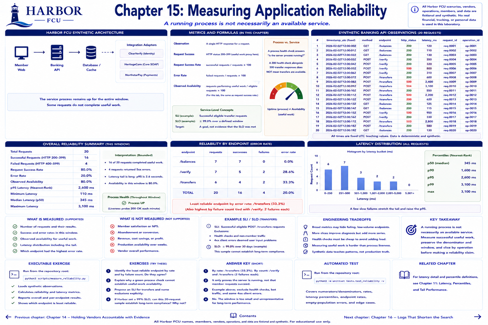

# Chapter 15: Measuring Application Reliability



Part IV follows an entirely synthetic Harbor Federal Credit Union (Harbor FCU) service from normal behavior through failure, detection, investigation, repair, recovery, and measurement.

> Reliability engineering is not simply fixing failures. It reduces how often failures occur, how much they affect users, and how long detection and recovery take.

## Learning objectives

- Calculate request count, successes, failures, success/error rates, availability, and latency.
- Distinguish a running process from a service performing useful work.
- Define a service-level indicator (SLI), objective (SLO), and reliability target.
- Locate the least reliable operation without confusing traffic volume with failure rate.

## Measurable-outcome concept

An **observation** is a request result. Harbor defines request success as an HTTP status from 200 through 399. The numerator is successful requests; the denominator is all requests in the measured window:

```text
request success rate = successful requests / requests × 100
error rate           = failed requests / requests × 100
observed availability = requests performing useful work / eligible requests × 100
```

For this laboratory the first and third formulas have the same implementation. A production service might define useful work more narrowly—for example, excluding a technically successful response with an invalid payload. State that rule before measuring.

A process health check answers “is the server process running?” A 200 health check alongside 500 transfer responses does **not** mean transfers are available. Uptime describes process/time availability conceptually; request-based observed availability measures member-facing work in this sample.

An SLI is the measurement (successful eligible transfer requests). An SLO is the desired level over a window (for example, at least 99.0%). A target is not evidence that the objective was met.

## Planned Harbor FCU scenario

The implemented architecture remains deliberately small:

```text
member web → banking API → database / cache / integration adapters
                                      ClearVerify, HeritageCore, NorthstarPay
```

Twenty deterministic banking-API observations cover balances, verification, and transfers. Status, latency, endpoint, request ID, and operation ID are synthetic. The service process remains up throughout; some useful requests fail.

## Metrics to measure

- Request count, successful and failed request count.
- Overall request success/error rate and observed availability.
- Nearest-rank p95 latency, reusing Chapter 11's percentile utility.
- Endpoint error rate: failed endpoint requests / all endpoint requests.
- Failures by endpoint, kept beside the rate so a small denominator remains visible.

The measurement window and traffic mix are fixed teaching fixtures, not a production SLO report. HTTP status is a useful-work proxy here; semantic correctness is not independently tested.

## Planned executable exercise

Reusable records and calculations live in [`src/harbor_fcu/reliability.py`](../../src/harbor_fcu/reliability.py). Run:

```bash
python3 scripts/measure_reliability.py
```

Observe that `/transfers` has the highest endpoint error rate. Also inspect latency: failure latency affects the tail. The supported claim is “transfers were the least reliable function in this synthetic sample.” It is not evidence about a real credit union, future traffic, or member retention.

## Engineering tradeoffs

A broad availability metric is easy to communicate but can hide a failing low-volume endpoint. Endpoint slices improve diagnosis but create more series and smaller denominators. A liveness probe should remain cheap; a useful-work health signal can check more dependencies but might itself add load or fail for reasons unrelated to the service.

## Automated tests

```bash
python3 -m unittest tests.test_reliability.ReliabilityMeasurementTest -v
```

Tests establish numerator/denominator behavior, expected endpoint rates, and the empty-population error. They do not prove production reliability.

## Exercises

1. Identify the least reliable endpoint by rate and by failure count. Do they agree?
2. Explain why a green process check cannot establish useful-work availability.
3. Propose an SLI for transfers and name exclusions explicitly.
4. If Harbor set a 99% SLO, can this 20-request sample establish long-term compliance? Why not?

## Expected takeaway

A running process is not necessarily an available service. Measure successful useful work, preserve its denominator and window, and slice by operation before making a reliability claim.

[Previous chapter](../part-03-apis-integrations/chapter-14-holding-vendors-accountable-with-evidence.md) | [Contents](../../CONTENTS.md) | [Next chapter](chapter-16-logs-that-shorten-the-search.md)
