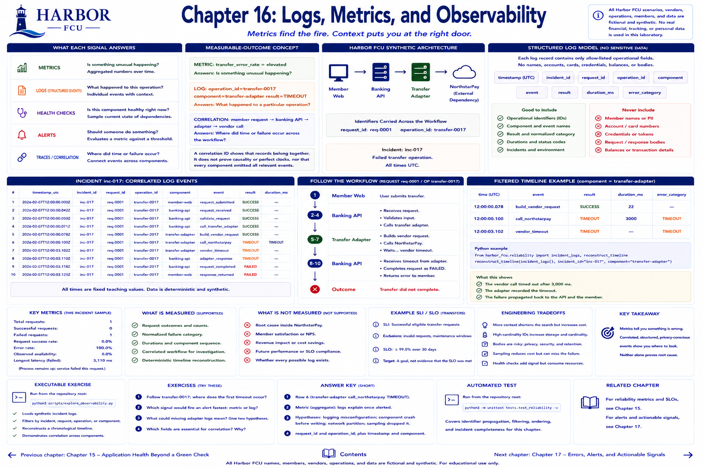

# Chapter 16: Logs, Metrics, and Observability



## Learning objectives

- Explain the different questions answered by metrics, logs, health checks, alerts, and traces/correlation.
- Follow one failed Harbor operation across components using contextual identifiers.
- Reconstruct a filtered, chronological timeline.
- Keep sensitive financial and member data out of operational logs.

## Measurable-outcome concept

Metrics help you notice a problem; contextual telemetry helps you investigate it.

```text
METRIC: transfer_error_rate = elevated
Answers: Is something unusual happening?

LOG: operation_id=transfer-0017 component=transfer-adapter result=TIMEOUT
Answers: What happened to a particular operation?

CORRELATION: member request → banking API → adapter → vendor call
Answers: Where did time or failure occur across the workflow?
```

A trace is conceptually a connected workflow with timing across boundaries. This textbook does not require a tracing product. Shared `request_id` and `operation_id` fields provide a lightweight deterministic correlation model. A health check samples current component state. An alert evaluates a metric against an action threshold; it is not the underlying evidence.

## Planned Harbor FCU scenario

Incident `inc-017` contains a failed transfer. The request passes through the banking API, transfer adapter, and fictional NorthstarPay dependency. Several components log symptoms. All records and identifiers are synthetic.

The structured log model contains only:

```text
timestamp, incident_id, request_id, operation_id, component,
event, result, duration_ms, error_category
```

It intentionally excludes member names, account/card numbers, credentials, balances, and request bodies. Opaque operational IDs enable correlation without copying sensitive payloads into a broadly accessed log system.

## Metrics to measure

- Correlated event count per request or operation.
- Component sequence and per-event duration.
- Normalized failure category.
- Time ordering across the incident.
- Diagnostic effort (queries) in Chapter 19.

A correlation ID shows that records belong together. It does not prove causality, clocks are perfectly synchronized, or every component emitted all relevant events.

## Planned executable exercise

`reconstruct_timeline` sorts UTC timestamps and accepts filters for incident, request, operation, and component. Run:

```bash
python3 scripts/explore_observability.py
```

What to observe:

1. The operation and request identifiers remain stable at each boundary.
2. The adapter and vendor records carry a timeout category.
3. The API records the final failed request.
4. No sensitive member data is needed to answer where the workflow failed.

Try a component filter in Python:

```python
reconstruct_timeline(incident_logs(), incident_id="inc-017", component="banking-api")
```

## Engineering tradeoffs

More context can shorten a search, but high-cardinality identifiers increase telemetry volume. Detailed bodies might appear convenient during debugging but create security, privacy, and retention risk. Prefer allow-listed fields, opaque IDs, normalized categories, and explicit retention. Sampling lowers cost but can omit the exact failed operation.

## Automated tests

```bash
python3 -m unittest tests.test_reliability.ObservabilityTest -v
```

The tests verify identifier propagation, component coverage, filters, and chronological ordering.

## Exercises

1. Follow `transfer-0017`; which record first contains a dependency-specific failure?
2. Which metric could alert without requiring per-request scanning?
3. What could missing adapter logs mean? List at least two hypotheses.
4. Review the log fields and explain why each is operationally useful without including financial data.

## Expected takeaway

Metrics locate unusual behavior in aggregate. Structured, correlated, privacy-conscious events narrow an investigation. Neither alone establishes root cause.

[Previous chapter](chapter-15-application-health-beyond-a-green-check.md) | [Contents](../../CONTENTS.md) | [Next chapter](chapter-17-errors-alerts-and-actionable-signals.md)
