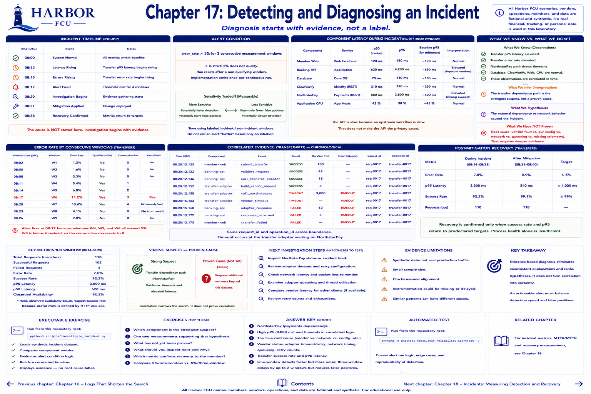

# Chapter 17: Detecting and Diagnosing an Incident



At 08:00 the synthetic Harbor FCU system is normal. At 08:12 transfer latency rises, at 08:15 errors rise, at 08:17 an alert fires, and at 08:20 investigation begins. The cause is deliberately not stated here: diagnosis starts with evidence, not a label.

## Learning objectives

- Compare application, database, integration, web, and service-health evidence.
- Evaluate an error-rate alert over consecutive windows.
- Distinguish a strong suspect from a proven root cause.
- Choose a recovery metric that represents useful work.

## Measurable-outcome concept

An alert condition is explicit:

```text
error_rate > 5% for 3 consecutive measurement windows
```

`>` is strict: a 5% window does not qualify. A run resets after a non-qualifying window, and the implementation emits once per continuous run. Detection is therefore reproducible.

Sensitivity is a measurable tradeoff:

```text
more sensitive → potentially faster detection → potentially more false positives
less sensitive → potentially fewer false positives → potentially slower detection
```

Tune against labeled incident/non-incident windows; do not call an alert “better” based only on intuition.

## Planned Harbor FCU scenario

Member report: “Transfers are taking a long time.” During `inc-017`:

| Component | p50 | p95 |
|---|---:|---:|
| Member Web | 120 ms | 180 ms |
| Banking API | 620 ms | 4,200 ms |
| Database | 70 ms | 110 ms |
| ClearVerify | 210 ms | 290 ms |
| NorthstarPay | 880 ms | 3,800 ms |
| Application CPU | 42% | 58% |

The API is slow because an upstream workflow is slow; that does not make it the primary cause. Database, ClearVerify, web rendering, and CPU remain near their scenario norms. Correlated records show timeouts at the transfer boundary. This makes the transfer dependency path the strongest suspect, not a proven vendor root cause. Network loss, adapter timeout configuration, queuing, or omitted telemetry could produce similar observations.

## Metrics to measure

- Endpoint success/error rate and p95 latency.
- Database, integration, web, and API p95 latency on the same window.
- Normal resource health signals.
- Consecutive threshold windows and alert timestamp.
- Post-mitigation transfer success rate and p95.

## Planned executable exercise

Run the evidence-only investigation:

```bash
python3 scripts/investigate_incident.py
```

It does not print `ROOT CAUSE = X`. Build a hypothesis from component contrasts and the correlated timeline. Confirm recovery only when transfer useful-work error rate and p95 return to their predeclared targets; a green process check is insufficient.

Alert behavior is reusable through `evaluate_alerts` in [`reliability.py`](../../src/harbor_fcu/reliability.py). It accepts deterministic windows, a percentage threshold, and a consecutive-window count.

## Engineering tradeoffs and evidence limitations

A one-window alarm can detect quickly but page on harmless spikes. Requiring consecutive windows delays notification by design. Aggregated API latency shows member impact but can implicate every downstream component. Dependency timing narrows the search, yet common-clock and instrumentation errors remain possible.

Use four evidence levels:

- **Observation:** NorthstarPay-path p95 is 3,800 ms and timeout logs correlate with failures.
- **Interpretation:** the transfer dependency path is the strongest suspect.
- **Hypothesis:** the external dependency itself caused the incident.
- **Causal claim:** requires stronger intervention or provider/network evidence than this fixture supplies.

## Automated tests

```bash
python3 -m unittest tests.test_reliability.AlertTest -v
```

## Exercises

1. Which component is the strongest suspect?
2. Cite two measurements supporting that hypothesis.
3. What has not yet been proven?
4. Would you inspect adapter queue time, network timing, vendor status, or retry counts next? Explain.
5. Which member-facing metric confirms recovery?
6. Compare a 5%/one-window rule with the documented three-window rule. Predict detection and noise effects, then measure both.

## Expected takeaway

Evidence-based diagnosis eliminates inconsistent explanations and ranks hypotheses. It does not turn correlation into certainty. An actionable alert must balance detection speed and false positives.

[Previous chapter](chapter-16-logs-that-shorten-the-search.md) | [Contents](../../CONTENTS.md) | [Next chapter](chapter-18-incidents-measuring-detection-and-recovery.md)
