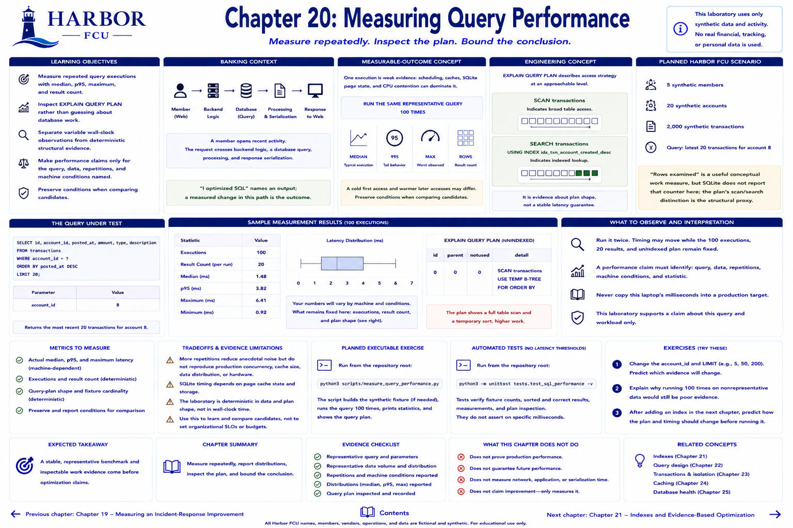

# Chapter 20: Measuring Query Performance



> **Implementation status:** Complete. All people, accounts, and activity are synthetic.

## Learning objectives

- Measure repeated query executions with median, p95, maximum, and result count.
- inspect `EXPLAIN QUERY PLAN` rather than guessing about database work.
- Separate variable wall-clock observations from deterministic structural evidence.

## Banking context

A member opens recent activity. The request crosses backend logic, a database query, processing, and response serialization. “I optimized SQL” names an output; a measured change in this path is the outcome.

## Measurable-outcome concept

One execution is weak evidence: scheduling, caches, SQLite page state, and CPU contention can dominate it. The lab runs the same representative query 100 times and reports median (typical execution), p95 (tail), maximum, and rows returned. A cold first access and warmer later accesses may differ, so preserve conditions when comparing candidates.

## Planned Harbor FCU scenario

The implemented fixture has five fictional members, twenty accounts, and 2,000 deterministic transactions. The query returns the latest 20 transactions for account 8. “Rows examined” is a useful conceptual work measure, but SQLite does not report that counter here; the plan's scan/search distinction is the structural proxy.

## Engineering concept

`EXPLAIN QUERY PLAN` describes access strategy at an approachable level. `SCAN transactions` indicates broad table access; `SEARCH ... USING INDEX` indicates indexed lookup. It is evidence about plan shape, not a stable latency guarantee.

## Metrics to measure

- actual median, p95, and maximum query latency (machine-dependent);
- executions and result count (deterministic);
- query-plan shape and fixture cardinality (deterministic).

## Planned executable exercise

```bash
python3 scripts/measure_query_performance.py
```

## What to observe and interpretation

Run it twice. Timing may move while the 100 executions, 20 results, and unindexed plan remain fixed. A performance claim must identify query, data, repetitions, machine conditions, and statistic. Never copy this laptop's milliseconds into a production target.

## Tradeoffs and evidence limitations

More repetitions reduce anecdotal noise but do not reproduce production concurrency, cache size, data distribution, or hardware. The laboratory supports a claim about this query and workload only.

## Automated tests and exercises

Tests verify fixture counts, sorted/correct results, measurements, and plan inspection without latency thresholds. Exercise: change account and result limit; predict which evidence changes. Explain why 100 repeated nonrepresentative queries would still be poor evidence.

## Expected takeaway

A stable, representative benchmark and inspectable work evidence come before optimization claims.

## Chapter summary

Measure repeatedly, report distributions, inspect the plan, and bound the conclusion.

[Previous chapter](../part-04-reliability/chapter-19-availability-error-budgets-and-learning-reviews.md) | [Contents](../../CONTENTS.md) | [Next chapter](chapter-21-indexes-and-evidence-based-optimization.md)
