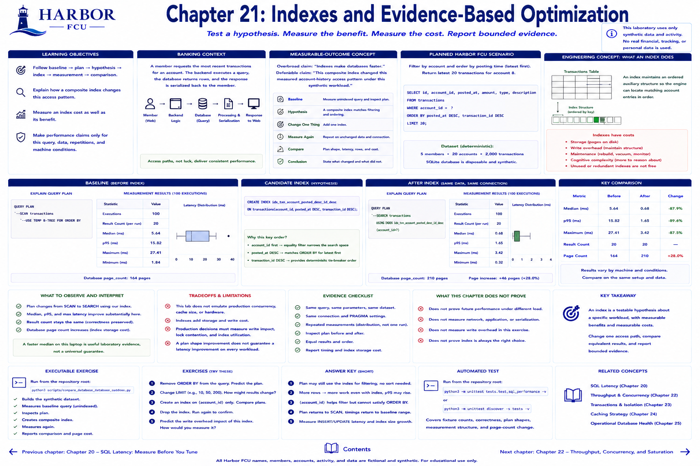

# Chapter 21: Indexes and Evidence-Based Optimization



> **Implementation status:** Complete; the SQLite database is disposable and synthetic.

## Learning objectives

- Follow baseline → plan → hypothesis → index → measurement → comparison.
- Explain how a composite index changes this access pattern.
- Measure an index cost as well as its benefit.

## Banking context

Transaction history filters by account and orders by posting time. Without a matching access path SQLite may inspect and sort much more data than the endpoint returns.

## Measurable-outcome concept

“Indexes make databases faster” is overbroad. The defensible statement is: “This composite index changed this measured account-history access pattern under this synthetic workload.” Observed timing strengthens that statement when it improves, but is explicitly machine-dependent.

## Planned Harbor FCU scenario

Measure the unindexed query, inspect its plan, hypothesize that `(account_id, posted_at DESC, transaction_id DESC)` matches filtering and ordering, add it, and repeat on unchanged data.

## Engineering concept

An index maintains an ordered auxiliary structure so the engine can locate matching account entries. It consumes pages and makes writes maintain another structure. Indexes add storage, write overhead, maintenance, and cognitive complexity; unused or redundant indexes are not free.

## Metrics to measure

Before/after plan text, repeated observed latency, rows returned, and SQLite page count. Page growth is a deterministic, practical storage tradeoff in this fixture.

## Planned executable exercise

```bash
python3 scripts/compare_database_index.py
```

## What to observe and interpretation

Look for `SCAN` before and indexed `SEARCH` after. Confirm database pages increase. A faster median on one machine is useful laboratory evidence, not a universal guarantee. Compare on the same connection/data and avoid changing two independent variables.

## Engineering tradeoffs and evidence limitations

The lab does not emulate production write rate, long-lived cache, lock contention, or storage. A production decision also measures insert/update latency and index utilization over representative traffic.

## Automated tests and exercises

Tests assert plan shape changes and identical query results. Exercise: remove ordering columns from the index, inspect the plan, and describe the experiment needed to assess write overhead.

## Expected takeaway

An index is a testable hypothesis about a specific workload, with measurable costs.

## Chapter summary

Inspect, hypothesize, change one access path, compare equivalent results, and report bounded evidence.

[Previous chapter](chapter-20-sql-latency-measure-before-you-tune.md) | [Contents](../../CONTENTS.md) | [Next chapter](chapter-22-throughput-concurrency-and-saturation.md)
