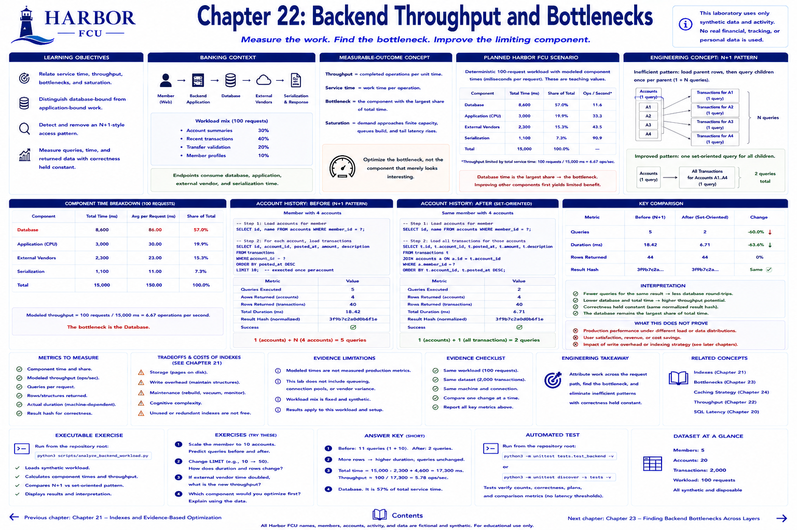

# Chapter 22: Backend Throughput and Bottlenecks



> **Implementation status:** Complete; modeled component time is deterministic teaching data.

## Learning objectives

- Relate service time, throughput, bottlenecks, and saturation.
- Distinguish database-bound from application-bound work.
- Detect and remove an N+1-style access pattern.

## Banking context

Harbor's workload represents account summaries, recent transactions, transfer validation, and member profiles. Endpoints consume database, application, fictional vendor, and serialization time.

## Measurable-outcome concept

Throughput is completed operations per unit time; service time is work time per operation. A bottleneck is the limiting component. Saturation occurs when demand approaches finite capacity, causing queues and tail latency. Optimize the bottleneck, not the component that merely looks interesting.

## Planned Harbor FCU scenario

The deterministic 100-request workload assigns measured/simulated component milliseconds, calculates shares and operations per second, and identifies database work as the largest share. These modeled figures are stable evidence about the exercise, not observed production performance.

## Engineering concept

The deliberately inefficient account-history implementation first loads a member's accounts and then queries transactions once per account: one plus N queries. The improved version uses one account query and one set-oriented transaction query. Instrumentation records operation, query count, duration, rows, normalized result hash, and success.

## Metrics to measure

Component time/share, modeled throughput, queries/request, returned structures, actual duration, and result hash. Query count and equality are deterministic; duration is observational.

## Planned executable exercise

```bash
python3 scripts/analyze_backend_workload.py
```

## What to observe and interpretation

The account request changes from five queries (one plus four accounts) to two. Both return four account records and the same hash. This directly supports “fewer queries for this operation”; it does not establish member satisfaction or cost savings.

## Engineering tradeoffs and evidence limitations

Batching can return extra rows and use memory; the lab groups and limits them in application code. Production alternatives include window functions or carefully shaped queries. A throughput model omits queueing, connection pools, and vendor variance.

## Automated tests and exercises

Tests verify component arithmetic, bottleneck selection, exact query counts, and equivalent normalized results. Exercise: scale to all twenty accounts and predict 21 versus two queries; then measure data volume.

## Expected takeaway

Attribute work across the request and improve the limiting access pattern with correctness held constant.

## Chapter summary

Backend outcomes require workload-level measures, not isolated micro-optimizations.

[Previous chapter](chapter-21-indexes-and-evidence-based-optimization.md) | [Contents](../../CONTENTS.md) | [Next chapter](chapter-23-finding-backend-bottlenecks-across-layers.md)
