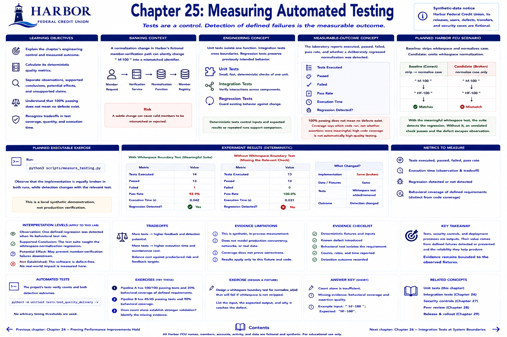

# Chapter 25: Measuring Automated Testing



> **Synthetic-data notice:** Harbor Federal Credit Union, its releases, users, defects, transfers, and security cases are fictional.

## Learning objectives

- Explain the chapter's engineering control and measured outcome.
- Calculate its deterministic quality metrics.
- Separate observations, supported conclusions, potential effects, and unsupported claims.

## Banking context and engineering concept
A normalization change in Harbor's fictional member-verification path can silently change `" hf-100 "` into a mismatched identifier. Unit tests isolate one function, integration tests cross boundaries, and regression tests preserve previously intended behavior. Deterministic tests control inputs and expected results so repeated runs support comparison.

## Measurable-outcome concept
The laboratory reports executed, passed, failed, pass rate, and whether a deliberately regressed normalization was detected. **100% passing does not mean no defects exist.** Coverage says which code ran, not whether assertions were meaningful; high code coverage is not automatically high-quality testing. Execution time is also an observation and becomes a tradeoff in Chapter 29.

## Planned Harbor FCU scenario
The baseline strips whitespace and normalizes case. A candidate omits whitespace normalization. With the meaningful fixture, the suite detects it; without that fixture, an unrelated check passes and the regression escapes observation.

## Metrics to measure
Tests executed, passed, failed, pass rate, execution time, and regression detected/not detected. Behavioral coverage of defined requirements is distinct from test quantity and line coverage.

## Planned executable exercise
```bash
python3 scripts/measure_testing.py
```
Observe that the implementation is equally broken in both runs, while detection changes with the relevant test. This is a local synthetic demonstration, not production verification.

## Interpretation and tradeoffs
The supported conclusion is that one defined regression was detected when its behavioral test ran. It may prevent a member-verification failure downstream. It does not establish defect-free software. More tests can cost execution and maintenance time; teams should compare that cost with predeclared risk and feedback targets.

## Automated tests
`tests/test_quality_delivery.py` verifies counts and both detection outcomes.

## Exercises
Pipeline A has 100/100 passing tests and 20% behavioral coverage of defined requirements. Pipeline B has 45/45 and 90%. Does count alone establish stronger validation? Identify the missing evidence and design a whitespace boundary fixture.

## Expected takeaway

Tests, security controls, and deployment processes are outputs. Their value comes from defined failures detected or prevented and the reliability they help produce; evidence remains bounded to the observed fixtures.

## Chapter summary

The laboratory measures a quality control, preserves a valid-behavior guardrail, and states its limitations. Continue to the next chapter to move one step toward a measured delivery outcome.

[Previous chapter](../part-05-databases/chapter-24-proving-performance-improvements-hold.md) | [Contents](../../CONTENTS.md) | [Next chapter](chapter-26-integration-tests-at-system-boundaries.md)
