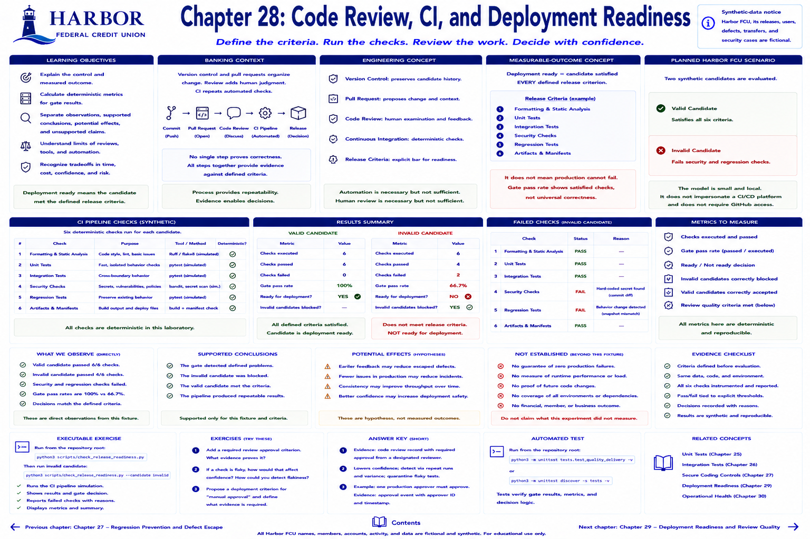

# Chapter 28: Code Review, CI, and Deployment Readiness



> **Synthetic-data notice:** Harbor Federal Credit Union, its releases, users, defects, transfers, and security cases are fictional.

## Learning objectives

- Explain the chapter's engineering control and measured outcome.
- Calculate its deterministic quality metrics.
- Separate observations, supported conclusions, potential effects, and unsupported claims.

## Banking context and engineering concept
Version control preserves candidate history; a pull request organizes discussion; review adds human examination; continuous integration repeats automated checks. None alone proves correctness. Harbor models the flow locally: formatting/static checks → unit → integration → security → regression → artifacts → readiness.

## Measurable-outcome concept
Deployment ready means the candidate satisfied the **defined** release criteria. It does not mean production cannot fail. Gate pass rate reveals satisfied checks, while the decision requires every declared criterion.

## Planned Harbor FCU scenario
The valid candidate passes six deterministic criteria. The intentionally invalid candidate fails security and regression checks. The model is intentionally small and does not impersonate a CI/CD platform or require GitHub access.

## Metrics to measure
Checks executed/passed, gate pass rate, ready/not ready, invalid candidates blocked, and valid candidates accepted. Review quality also needs criteria such as required approval and unresolved findings; approval count alone is a weak proxy.

## Planned executable exercise
```bash
python3 scripts/check_release_readiness.py
python3 scripts/check_release_readiness.py --candidate invalid
```
Both commands complete so learners can inspect a positive gate and expected rejection. The checks map to real tested functions and required repository artifacts; the simulation supplies deterministic candidate states.

## Interpretation and tradeoffs
A gate gives repeatability and earlier feedback but costs time and maintenance. A passed gate supports release against its criteria only. Runtime configuration, traffic, novel defects, and external dependencies can still cause production failure.

## Automated tests
Tests assert valid acceptance, invalid rejection, and the specific failed checks.

## Exercises
Draft a release criterion for required review. What observable evidence proves it ran, and what does that evidence still not prove?

## Expected takeaway

Tests, security controls, and deployment processes are outputs. Their value comes from defined failures detected or prevented and the reliability they help produce; evidence remains bounded to the observed fixtures.

## Chapter summary

The laboratory measures a quality control, preserves a valid-behavior guardrail, and states its limitations. Continue to the next chapter to move one step toward a measured delivery outcome.

[Previous chapter](chapter-27-regression-prevention-and-defect-escape.md) | [Contents](../../CONTENTS.md) | [Next chapter](chapter-29-deployment-readiness-and-review-quality.md)
