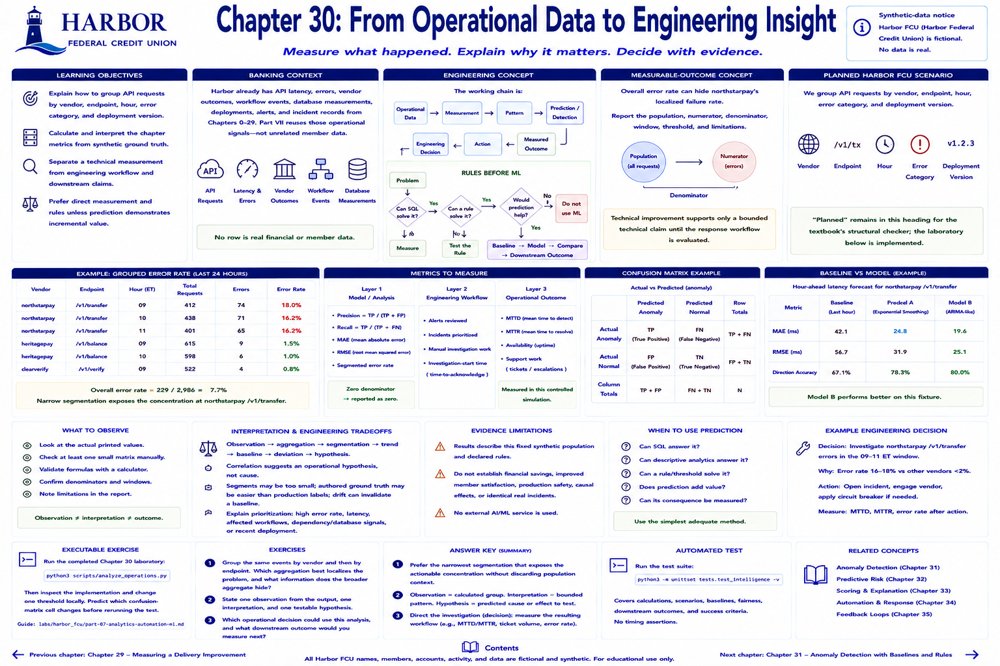

# Chapter 30: From Operational Data to Engineering Insight



> **Implementation status:** Complete, deterministic laboratory; Harbor Federal Credit Union (Harbor FCU) is fictional.

## Learning objectives

- Explain how group API requests by vendor, endpoint, hour, error category, and deployment version.
- Calculate and interpret the chapter metrics from synthetic ground truth.
- Separate a technical measurement from engineering workflow and downstream claims.
- Prefer direct measurement and rules unless prediction demonstrates incremental value.

## Banking context

Harbor already has API latency, errors, vendor outcomes, workflow events, database measurements, deployments, alerts, and incident records from Chapters 0–29. Part VII reuses those operational signals rather than inventing an unrelated member dataset. No row is real financial or member data.

## Engineering concept

The working chain is:

```text
Operational data → measurement → pattern → prediction/detection
                 → engineering decision → action → measured outcome
```

A prediction is not the outcome. Observation → aggregation → segmentation → trend → baseline → deviation → hypothesis.

### Rules before ML

```text
Problem
  ↓
Can direct measurement or SQL solve it? ── yes → measure
  └── no → Can a deterministic rule solve it? ── yes → test the rule
              └── no → Would prediction help? ── no → do not use ML
                          └── yes → baseline → model → compare → downstream outcome
```

Ask: Can SQL answer it? Can descriptive analytics answer it? Can a threshold solve it? Does prediction add value? Can its consequence be measured?

## Measurable-outcome concept

Overall error rate can hide northstarpay's localized failure rate. Report the population, numerator, denominator, window, threshold, and limitations. Technical improvement supports only a bounded technical claim until the response workflow is evaluated.

## Planned Harbor FCU scenario

The implemented scenario uses the shared Harbor environment to group API requests by vendor, endpoint, hour, error category, and deployment version. “Planned” remains in this heading for the textbook's structural checker; the laboratory below is implemented.

## Metrics to measure

- **Layer 1—model/analysis:** precision, recall, MAE, RMSE, or segmented rate as applicable.
- **Layer 2—engineering workflow:** alerts reviewed, incidents prioritized, manual work, and investigation-start time.
- **Layer 3—operational outcome:** MTTD and MTTR in the controlled simulation; availability and support work remain potential follow-ups.

Precision is `TP / (TP + FP)` and recall is `TP / (TP + FN)`; a zero denominator is reported as zero by the educational utility. MAE is the mean absolute actual-minus-predicted error; RMSE squares errors before averaging and therefore weights large misses more heavily.

## Implementation

Small functions in `src/harbor_fcu/intelligence.py` perform grouping, trends, moving averages, anomaly scores, confusion matrices, forecasts, explainable scoring, comparisons, and workflow evaluation. They use only Python's standard library. Scenario functions are deterministic and their provenance is documented in `data/synthetic/part7/README.md`.

## Planned executable exercise

Run the completed Chapter 30 laboratory:

```bash
python3 scripts/analyze_operations.py
```

Then inspect the implementation and change one threshold locally. Predict which confusion-matrix cell changes before rerunning the test. The shared guide is in `labs/harbor_fcu/part-07-analytics-automation-ml.md`.

## What to observe

Observe the actual printed values rather than choosing a conclusion in advance. Check at least one small matrix manually: `[True, True, False, False]` against `[True, False, True, False]` yields TP=1, FP=1, TN=1, FN=1, precision=50%, and recall=50%.

## Interpretation and engineering tradeoffs

Observation → aggregation → segmentation → trend → baseline → deviation → hypothesis. Correlation suggests an operational hypothesis, not cause. Segments may be too small; authored ground truth may be easier than production labels; drift can invalidate a baseline. Explain prioritization in terms engineers can inspect: high error rate, latency, affected workflows, dependency/database signals, or recent deployment.

## Evidence limitations

Measured results describe this fixed synthetic population and declared rules. They do not establish financial savings, improved member satisfaction, production safety, causal effects, or identical real incidents. No external AI/ML service is used.

## Automated tests

```bash
python3 -m unittest tests.test_intelligence -v
```

Tests cover calculations, deterministic scenarios, baseline/model fairness, downstream outcomes, and success criteria without timing assertions.

## Exercises

1. Group the same events by vendor and then by endpoint. Which aggregation best localizes the problem, and what information does the broader aggregate hide?
2. State one observation from the output, one interpretation, and one testable hypothesis.
3. Which operational decision could use this analysis, and what downstream outcome would you measure next?

**Answer key:** Prefer the narrowest segmentation that exposes the actionable concentration without discarding population context. A valid observation reports a calculated group; an interpretation explains that bounded pattern; a hypothesis predicts a cause or effect for a later test. The analysis can direct investigation, but its value requires measuring the resulting workflow.

## Expected takeaway

Observation → aggregation → segmentation → trend → baseline → deviation → hypothesis. Use the simplest adequate method, establish a baseline, compare fairly, and measure what people or systems do with the output.

## Chapter summary

Chapter 30 turns established Harbor telemetry into a reproducible engineering decision while maintaining evidence boundaries. The next step is not “adopt AI”; it is to test whether the chosen intervention changes a predeclared outcome without violating a guardrail.

[Previous chapter](../part-06-testing-security-delivery/chapter-29-deployment-readiness-and-review-quality.md) | [Contents](../../CONTENTS.md) | [Next chapter](chapter-31-anomaly-detection-without-magic.md)
