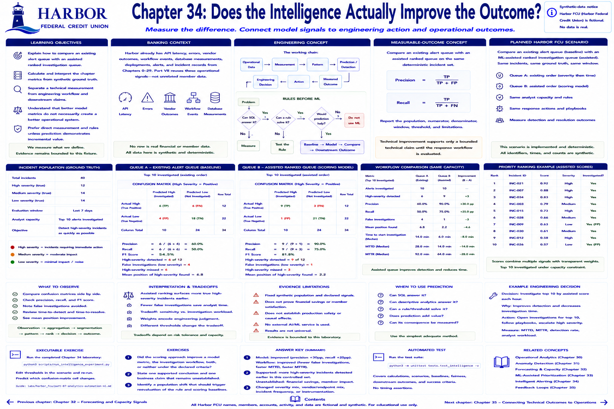

# Chapter 34: Does the Intelligence Actually Improve the Outcome?



> **Implementation status:** Complete, deterministic laboratory; Harbor Federal Credit Union (Harbor FCU) is fictional.

## Learning objectives

- Explain how compare an existing alert queue with an assisted ranked investigation queue.
- Calculate and interpret the chapter metrics from synthetic ground truth.
- Separate a technical measurement from engineering workflow and downstream claims.
- Prefer direct measurement and rules unless prediction demonstrates incremental value.

## Banking context

Harbor already has API latency, errors, vendor outcomes, workflow events, database measurements, deployments, alerts, and incident records from Chapters 0–29. Part VII reuses those operational signals rather than inventing an unrelated member dataset. No row is real financial or member data.

## Engineering concept

The working chain is:

```text
Operational data → measurement → pattern → prediction/detection
                 → engineering decision → action → measured outcome
```

A prediction is not the outcome. Better model metrics do not necessarily create a better operational system.

### Rules before ML

```text
Problem
  ↓
Can direct measurement or SQL solve it? ── yes → measure
  └── no → Can a deterministic rule solve it? ── yes → test the rule
              └── no → Would prediction help? ── no → do not use ML
                          └── yes → baseline → model → compare → downstream outcome
```

Ask: Can SQL answer it? Can descriptive analytics answer it? Can a threshold solve it? Does prediction add value? Can its consequence be measured?

## Measurable-outcome concept

Predeclared detection, prioritization, and workload criteria connect model, workflow, and operational layers. Report the population, numerator, denominator, window, threshold, and limitations. Technical improvement supports only a bounded technical claim until the response workflow is evaluated.

## Planned Harbor FCU scenario

The implemented scenario uses the shared Harbor environment to compare an existing alert queue with an assisted ranked investigation queue. “Planned” remains in this heading for the textbook's structural checker; the laboratory below is implemented.

## Metrics to measure

- **Layer 1—model/analysis:** precision, recall, MAE, RMSE, or segmented rate as applicable.
- **Layer 2—engineering workflow:** alerts reviewed, incidents prioritized, manual work, and investigation-start time.
- **Layer 3—operational outcome:** MTTD and MTTR in the controlled simulation; availability and support work remain potential follow-ups.

Precision is `TP / (TP + FP)` and recall is `TP / (TP + FN)`; a zero denominator is reported as zero by the educational utility. MAE is the mean absolute actual-minus-predicted error; RMSE squares errors before averaging and therefore weights large misses more heavily.

## Implementation

Small functions in `src/harbor_fcu/intelligence.py` perform grouping, trends, moving averages, anomaly scores, confusion matrices, forecasts, explainable scoring, comparisons, and workflow evaluation. They use only Python's standard library. Scenario functions are deterministic and their provenance is documented in `data/synthetic/part7/README.md`.

## Planned executable exercise

Run the completed Chapter 34 laboratory:

```bash
python3 scripts/run_intelligence_experiment.py
```

Then inspect the implementation and change one threshold locally. Predict which confusion-matrix cell changes before rerunning the test. The shared guide is in `labs/harbor_fcu/part-07-analytics-automation-ml.md`.

## What to observe

Observe the actual printed values rather than choosing a conclusion in advance. Check at least one small matrix manually: `[True, True, False, False]` against `[True, False, True, False]` yields TP=1, FP=1, TN=1, FN=1, precision=50%, and recall=50%.

## Interpretation and engineering tradeoffs

Better model metrics do not necessarily create a better operational system. Correlation suggests an operational hypothesis, not cause. Segments may be too small; authored ground truth may be easier than production labels; drift can invalidate a baseline. Explain prioritization in terms engineers can inspect: high error rate, latency, affected workflows, dependency/database signals, or recent deployment.

## Evidence limitations

Measured results describe this fixed synthetic population and declared rules. They do not establish financial savings, improved member satisfaction, production safety, causal effects, or identical real incidents. No external AI/ML service is used.

## Automated tests

```bash
python3 -m unittest tests.test_intelligence -v
```

Tests cover calculations, deterministic scenarios, baseline/model fairness, downstream outcomes, and success criteria without timing assertions.

## Exercises

1. Did the scoring approach improve a model metric, the investigation workflow, both, or neither under the declared criteria?
2. State one supported conclusion and one business claim that remains unestablished.
3. Identify a population shift that should trigger reevaluation of the rule and scoring baselines.

**Answer key:** Use the executable criteria to answer separately for prediction and downstream MTTD/MTTR or queue work. A supported statement is bounded to the controlled incident set; savings or avoided member harm remain unestablished without those measurements. A changed severity, vendor, endpoint, or incident-frequency mix warrants reevaluation.

## Expected takeaway

Better model metrics do not necessarily create a better operational system. Use the simplest adequate method, establish a baseline, compare fairly, and measure what people or systems do with the output.

## Chapter summary

Chapter 34 turns established Harbor telemetry into a reproducible engineering decision while maintaining evidence boundaries. The next step is not “adopt AI”; it is to test whether the chosen intervention changes a predeclared outcome without violating a guardrail.

## Part transition

Part VII separated model performance from workflow performance. Part VIII now connects the book's measured technical, member, delivery, and operational layers to carefully qualified business relevance and communication.

[Previous chapter](chapter-33-ml-assisted-incident-prioritization.md) | [Contents](../../CONTENTS.md) | [Next chapter](../part-08-business-impact/chapter-35-connecting-technical-outcomes-to-operations.md)
