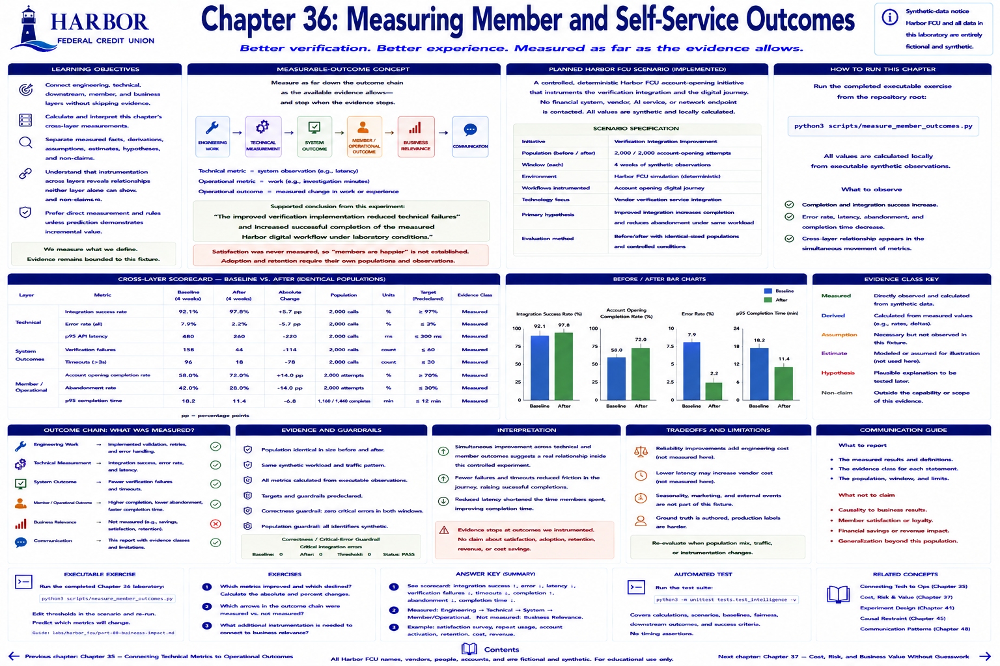

# Chapter 36: Measuring Member and Self-Service Outcomes



> **Implementation status:** Complete deterministic laboratory. Harbor Federal Credit Union (Harbor FCU), its vendors, people, accounts, transactions, and observations are entirely fictional and synthetic.

## Learning objectives

- Connect engineering, technical, downstream, and communication layers without skipping evidence.
- Calculate and interpret this chapter's cross-layer measurements.
- Separate measured facts, derivations, assumptions, estimates, hypotheses, and non-claims.

## Measurable-outcome concept

> Measure as far down the outcome chain as the available evidence allows—and stop when the evidence stops.

```text
ENGINEERING WORK → TECHNICAL MEASUREMENT → SYSTEM OUTCOME
                 → MEMBER / OPERATIONAL OUTCOME → BUSINESS RELEVANCE → COMMUNICATION
```

Instrumentation spans the controlled verification integration and the digital journey. For the identical-sized before/after populations it measures **technical** integration success, error rate, and p95 latency, plus **member behavior** completion, abandonment, and p95 completion time. The intervention and workload are controlled in this simulation, so simultaneous movement permits a stronger bounded cross-layer conclusion.

The supported statement is: “The improved verification implementation reduced technical failures and increased successful completion of the measured Harbor digital workflow under laboratory conditions.” Satisfaction was never measured, so “members are happier” is not established. Adoption and retention likewise require their own populations and observations.

## Planned Harbor FCU scenario

The planned scaffold is now implemented as a controlled, deterministic Harbor FCU account-opening initiative. It extends the shared simulation and contacts no financial system, vendor, AI service, or network endpoint.

## Metrics to measure

- Baseline, after, absolute change, population, and units for every reported metric.
- Technical and downstream measures appropriate to the chapter.
- Predeclared targets and correctness/critical-error guardrails where evaluated.
- Explicit evidence class for every business statement.

## Planned executable exercise

The completed executable exercise runs from the repository root:

`python3 scripts/measure_member_outcomes.py`

All values are calculated locally from executable synthetic observations.

## Expected takeaway

Check that completion and integration success improve while error, abandonment, latency, and completion time decrease. Cross-layer instrumentation reveals a relationship that either layer alone cannot show. This deterministic synthetic experiment has stronger internal evidence than an unmatched before/after observation, but it does not represent real members.

## Verification and reflection

1. Trace a displayed value to its numerator, denominator, or raw observation.
2. Identify which arrows in the outcome chain were measured and which remain hypotheses.
3. State one supported conclusion and one tempting claim the evidence does not establish.


[Previous chapter](chapter-35-connecting-technical-outcomes-to-operations.md) | [Contents](../../CONTENTS.md) | [Next chapter](chapter-37-cost-risk-and-business-value-without-guesswork.md)
