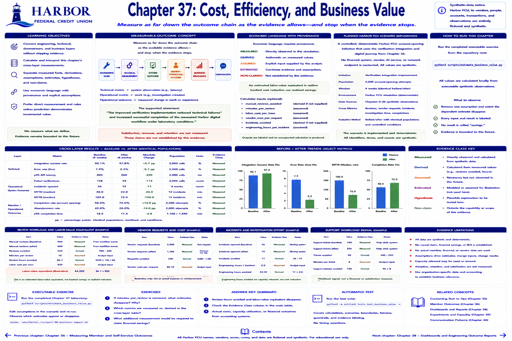

# Chapter 37: Cost, Efficiency, and Business Value



> **Implementation status:** Complete deterministic laboratory. Harbor Federal Credit Union (Harbor FCU), its vendors, people, accounts, transactions, and observations are entirely fictional and synthetic.

## Learning objectives

- Connect engineering, technical, downstream, and communication layers without skipping evidence.
- Calculate and interpret this chapter's cross-layer measurements.
- Separate measured facts, derivations, assumptions, estimates, hypotheses, and non-claims.

## Measurable-outcome concept

> Measure as far down the outcome chain as the available evidence allows—and stop when the evidence stops.

```text
ENGINEERING WORK → TECHNICAL MEASUREMENT → SYSTEM OUTCOME
                 → MEMBER / OPERATIONAL OUTCOME → BUSINESS RELEVANCE → COMMUNICATION
```

Economic language requires provenance. **MEASURED** is directly observed (reviews before and after). **DERIVED** is arithmetic on measured values (reviews avoided and hours). **ASSUMED** is an explicitly supplied input (minutes per review or hourly labor cost). **ESTIMATED** combines evidence and assumptions. An estimated labor-value equivalent is neither booked cost reduction nor realized savings.

The reusable calculator accepts optional `manual_reviews_avoided`, `minutes_per_review`, `labor_cost_per_hour`, `vendor_cost_per_request`, `incidents_avoided`, and `engineering_hours_per_incident`. It emits no unsupported calculation: without handling time it cannot derive review hours; without labor cost it cannot estimate a labor-value equivalent. Capacity released, vendor demand, support workload, and investigation time may matter even when a valid monetary unit cost is unavailable.

## Planned Harbor FCU scenario

The planned scaffold is now implemented as a controlled, deterministic Harbor FCU account-opening initiative. It extends the shared simulation and contacts no financial system, vendor, AI service, or network endpoint.

## Metrics to measure

- Baseline, after, absolute change, population, and units for every reported metric.
- Technical and downstream measures appropriate to the chapter.
- Predeclared targets and correctness/critical-error guardrails where evaluated.
- Explicit evidence class for every business statement.

## Planned executable exercise

The completed executable exercise runs from the repository root:

`python3 scripts/estimate_business_value.py`

All values are calculated locally from executable synthetic observations.

## Expected takeaway

Remove one assumption and observe the dependent estimate disappear. The report labels every input and result. It never calls an estimate savings. All assumptions and workload observations are teaching fixtures, not Harbor Federal Credit Union accounting facts.

## Verification and reflection

1. Trace a displayed value to its numerator, denominator, or raw observation.
2. Identify which arrows in the outcome chain were measured and which remain hypotheses.
3. State one supported conclusion and one tempting claim the evidence does not establish.


[Previous chapter](chapter-36-member-experience-adoption-and-causal-restraint.md) | [Contents](../../CONTENTS.md) | [Next chapter](chapter-38-dashboards-and-engineering-outcome-reports.md)
