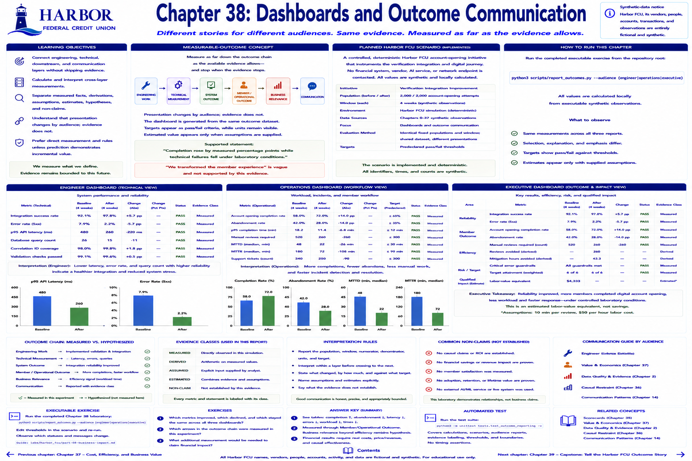

# Chapter 38: Dashboards and Outcome Communication



> **Implementation status:** Complete deterministic laboratory. Harbor Federal Credit Union (Harbor FCU), its vendors, people, accounts, transactions, and observations are entirely fictional and synthetic.

## Learning objectives

- Connect engineering, technical, downstream, and communication layers without skipping evidence.
- Calculate and interpret this chapter's cross-layer measurements.
- Separate measured facts, derivations, assumptions, estimates, hypotheses, and non-claims.

## Measurable-outcome concept

> Measure as far down the outcome chain as the available evidence allows—and stop when the evidence stops.

```text
ENGINEERING WORK → TECHNICAL MEASUREMENT → SYSTEM OUTCOME
                 → MEMBER / OPERATIONAL OUTCOME → BUSINESS RELEVANCE → COMMUNICATION
```

Presentation changes by audience; evidence does not. Engineers receive p95 latency, error rate, query count, and validation evidence. Product/operations receive workflow completion, manual reviews, incident duration, and support workload. Leadership receives quantitative reliability, member outcome, efficiency, risk/target trend, and explicit non-claims. Executive brevity is not permission for marketing language.

The dashboard is generated from the same `outcome_dataset()` used by every view. Targets appear as pass/fail criteria, while underlying units remain visible. Estimated value appears only when the report supplies assumptions.

## Planned Harbor FCU scenario

The planned scaffold is now implemented as a controlled, deterministic Harbor FCU account-opening initiative. It extends the shared simulation and contacts no financial system, vendor, AI service, or network endpoint.

## Metrics to measure

- Baseline, after, absolute change, population, and units for every reported metric.
- Technical and downstream measures appropriate to the chapter.
- Predeclared targets and correctness/critical-error guardrails where evaluated.
- Explicit evidence class for every business statement.

## Planned executable exercise

The completed executable exercise runs from the repository root:

`python3 scripts/report_outcomes.py --audience engineer`

`python3 scripts/report_outcomes.py --audience operations`

`python3 scripts/report_outcomes.py --audience executive`

All values are calculated locally from executable synthetic observations.

## Expected takeaway

Compare values across all three outputs: the selection and explanation differ, but the shared measurements do not. “Completion rose by measured percentage points while failures fell” is defensible; “we transformed experience” is vague and unsupported.

## Verification and reflection

1. Trace a displayed value to its numerator, denominator, or raw observation.
2. Identify which arrows in the outcome chain were measured and which remain hypotheses.
3. State one supported conclusion and one tempting claim the evidence does not establish.


[Previous chapter](chapter-37-cost-risk-and-business-value-without-guesswork.md) | [Contents](../../CONTENTS.md) | [Next chapter](chapter-39-capstone-tell-the-harbor-fcu-outcome-story.md)
